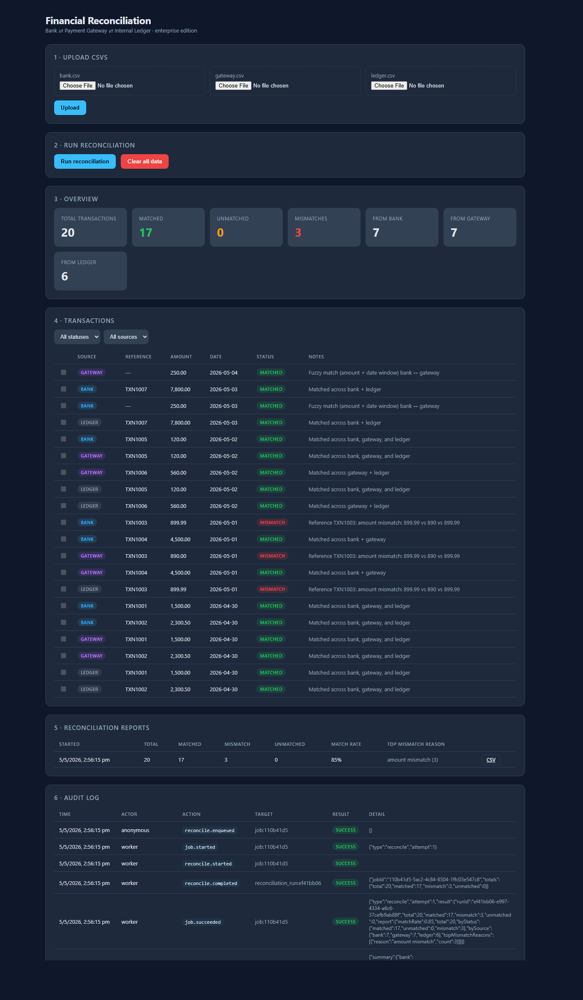

# Financial Reconciliation System

Reconciles transactions across **bank statements**, **payment gateway** exports, and the **internal ledger** — with audit trails, async job processing, retries, and historical reporting.



```
reconciliation-system/
├── backend/                          Node + Express + SQLite (node:sqlite)
│   ├── config/db.js                  SQLite handle + withTransaction helper
│   ├── middleware/requestContext.js  per-request id + actor + ip
│   ├── audit/auditService.js         append-only audit log writer
│   ├── jobs/
│   │   ├── queue.js                  enqueue / claim / complete / fail
│   │   ├── retry.js                  exponential backoff + jitter
│   │   ├── worker.js                 in-process polling worker
│   │   └── handlers/reconcileJob.js  reconciliation job handler
│   ├── controllers/                  HTTP layer (request → service → response)
│   ├── routes/                       Express routers, one per resource
│   ├── services/
│   │   ├── csvService.js             CSV parsing
│   │   └── reconcileService.js       Matching engine + report builder
│   ├── models/
│   │   ├── transactionModel.js       transactions table
│   │   └── runModel.js               reconciliation_runs + run_results
│   ├── utils/                        logger, asyncHandler, errorHandler
│   ├── db/schema.sql                 5 tables + indexes
│   ├── db/init.js                    schema apply + idempotent migrations
│   ├── sample-data/                  CSVs you can upload to try it
│   └── server.js                     Express bootstrap + worker start
└── frontend/                         React + Vite dashboard
    └── src/
        ├── pages/Dashboard.jsx
        ├── components/               FileUpload, StatsCards, Filters,
        │                             TransactionTable, JobStatus,
        │                             RunHistory, AuditLog
        └── services/api.js           Axios client (proxied to backend)
```

## Prerequisites
- **Node.js ≥ 22.5.0** (built-in `node:sqlite` — no native compile, no DB server)

## Run it
```powershell
# Backend
cd backend
copy .env.example .env
npm install
npm run db:init        # idempotent — safe to re-run after upgrades
npm run dev            # starts http://localhost:4000 + worker

# Frontend (separate terminal)
cd frontend
npm install
npm run dev            # starts http://localhost:5173
```

Open http://localhost:5173.

## Architecture at a glance

```
Browser  ──HTTP──▶  Express  ──enqueue──▶  jobs table  ──poll──▶  Worker
                       │                                              │
                       │   audit_log writes from controllers          │  audit_log writes
                       │   and the worker                             │  from worker
                       ▼                                              ▼
                   transactions ◀──────  reconcileService  ───▶ run_results
                                                  │
                                                  └──▶ reconciliation_runs (with report JSON)
```

- The HTTP request layer **never blocks on reconciliation** — it enqueues a job and returns 202 immediately.
- The worker polls the `jobs` table every 500ms, claims one row at a time inside a transaction, and runs the handler.
- Failures schedule a retry with exponential backoff + jitter. After `max_attempts` the job is marked `dead`.
- Every state change writes to `audit_log` (append-only).

## API

### Data ingestion
| Method | Path | Purpose |
|---|---|---|
| POST   | `/api/upload`            | multipart upload of `bank`/`gateway`/`ledger` CSVs |
| DELETE | `/api/upload`            | clear all transactions (audit log + run history retained) |
| GET    | `/api/transactions`      | list, with `?status=` and `?source=` filters |
| GET    | `/api/dashboard/stats`   | counts for dashboard cards |

### Reconciliation (async)
| Method | Path | Purpose |
|---|---|---|
| POST   | `/api/reconcile`         | enqueue a reconcile job — returns 202 + `jobId` |
| GET    | `/api/jobs/:id`          | poll job status + result |
| GET    | `/api/jobs`              | list jobs (`?type=`, `?status=`) |

### Reports
| Method | Path | Purpose |
|---|---|---|
| GET    | `/api/reports/runs`         | list past reconciliation runs |
| GET    | `/api/reports/runs/:id`     | single run with full report JSON |
| GET    | `/api/reports/runs/:id/rows`| every row that was part of that run |
| GET    | `/api/reports/runs/:id/csv` | CSV download |

### Audit
| Method | Path | Purpose |
|---|---|---|
| GET    | `/api/audit`             | list audit entries (`?action=`, `?targetType=`, `?targetId=`) |

## Reconciliation rules
1. **Reference-id pass** — group by `reference_id`. ≥2 sources agree on amount + date → `matched`. Disagree → `mismatch` with reason in `notes`.
2. **Fuzzy pass** — pair leftovers across sources when amount differs by ≤ `AMOUNT_TOLERANCE` and date is within `DATE_WINDOW_DAYS`.
3. **Leftovers** stay `unmatched`.

The whole run executes inside a single SQLite transaction. Each run snapshots its outcome into `run_results`, so historical reports stay accurate even after the next reconciliation resets the live `transactions` table.

## Background jobs

The worker runs **in the same process as the API** by default. Set `WORKER_ENABLED=false` to run a dedicated worker process (just start a second `node server.js` with that env var on a different `PORT`).

Job lifecycle:
```
pending  ──claim──▶  running ──complete──▶  succeeded
                       │
                       └──fail──▶  pending (retry, with backoff)
                                    │
                                    └── after max_attempts ──▶  dead
```

A `dedupe_key` (`'reconcile:active'`) ensures concurrent clicks coalesce onto one in-flight job. Once a job is succeeded/failed/dead, the same key can be enqueued again.

On worker startup, any `running` job is recovered (set back to `pending`) — protects against process crashes mid-job.

## Audit log

Every state-changing API call and every job lifecycle transition writes a row to `audit_log`. Entries are **append-only** — `DELETE /api/upload` clears transactions but leaves audit history intact. Schema:

```
id · ts · request_id · actor · ip · action · target_type · target_id · metadata (JSON) · result
```

Standard actions emitted today:
`transactions.upload`, `transactions.cleared`, `reconcile.enqueued`,
`reconcile.started`, `reconcile.completed`, `reconcile.failed`,
`job.started`, `job.succeeded`, `job.failed`, `job.dead`,
`report.export.csv`.

Pass `x-actor: alice@example.com` in any request header to attribute it (in lieu of real auth).

## Resetting the database
```powershell
del backend\db\recon.sqlite
cd backend ; npm run db:init
```

## Deployment

The frontend is a Vite SPA that builds to static files; the backend is a long-running Node process with SQLite + an in-process worker. They go on different hosts.

### Backend → Railway

1. https://railway.app/new → "Deploy from GitHub repo" → pick `reconciliation-software`.
2. **Service settings → Root Directory** = `backend`.
3. **Variables** — add at minimum:
   - `DB_FILE=/data/recon.sqlite`
   - (anything else from `backend/.env.example` you want to override)
4. **Volumes → New Volume** → mount path `/data`. SQLite needs persistent disk; Railway's ephemeral filesystem will lose data otherwise.
5. Deploy. Railway builds with nixpacks, runs `npm start`. The DB auto-bootstraps on first boot.
6. Note the public URL Railway gives you (e.g. `https://reconciliation-software-production.up.railway.app`).

### Frontend → Vercel

1. https://vercel.com/new → "Import Git Repository" → pick `reconciliation-software`.
2. **Root Directory** = `frontend`. Vercel detects Vite automatically.
3. **Environment Variables** → add `VITE_API_URL=https://<your-railway-url>/api`.
4. Deploy. Vercel runs `npm run build`, serves `dist/` from its CDN.

After both are live, the Vercel-hosted dashboard talks directly to Railway's backend. CORS is permissive (`cors()` middleware accepts any origin) — tighten to your Vercel domain in `backend/server.js` for production.

## Configuration
All in `backend/.env`:

| Var | Default | Purpose |
|---|---|---|
| `PORT` | 4000 | API port |
| `DB_FILE` | `./db/recon.sqlite` | SQLite path |
| `AMOUNT_TOLERANCE` | 0.01 | currency-unit tolerance for fuzzy match |
| `DATE_WINDOW_DAYS` | 1 | date window for fuzzy match |
| `WORKER_ENABLED` | true | run worker in-process |
| `WORKER_POLL_MS` | 500 | worker poll interval |
| `RECONCILE_MAX_ATTEMPTS` | 3 | retries before a reconcile job is `dead` |
